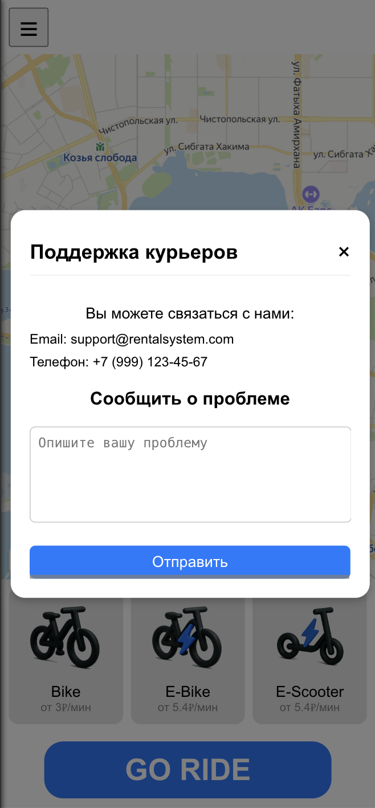
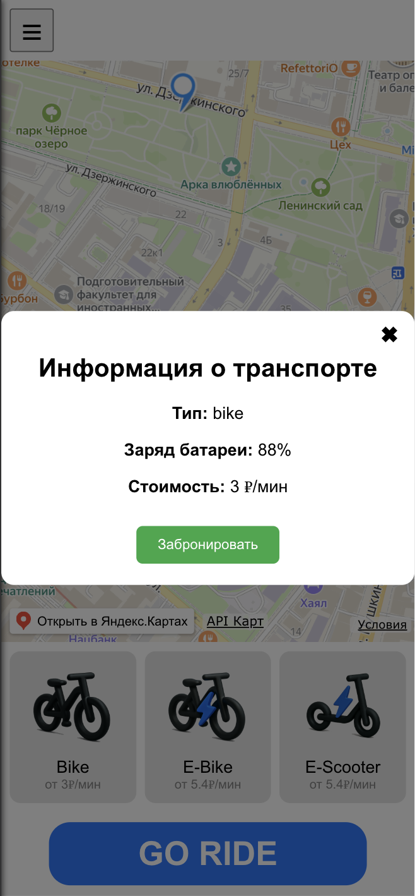

# Ручное тестирование Frontend

## Назначение

Ручное тестирование позволяет убедиться, что интерфейс работает корректно в основных сценариях использования

⸻

## Среда тестирования

**Операционная система:** 	
MacOS
 - Sequola 15.0.1

**Браузер:** \
Arc:
- Версия 1.97.0 (63507)
- Chromium Engine Version 137.0.7151.56

**Сервер API:**
> http://localhost:3031

**Запуск:**
> npm start

⸻

## Сценарии тестирования

## 1.   Запуск приложения
1. Открыть в браузере:
    >http://localhost:3000
2. Убедиться, что страница загружается без ошибок

3. Проверить наличие следующих элементов: 
   4. Карта 
   5. Боковое меню
   6. Блок выбора транспорта  
   7. Кнопка “GO RIDE” 

⸻

## 2. Меню (боковая панель) 
1. Нажать кнопку ☰ (бургер-меню) 
### Убедиться, что меню открывается 
## Проверить наличие следующих пунктов: 
### Профиль 

### Оплата

### История 

### Поддержка 

### Настройки

### Закрыть меню кнопкой ×
### При клике на каждый пункт меню должно открываться соответствующее действие или страница 

⸻

## 3. Регистрация и профиль
### 1. Нажать на кнопку "Профиль" в меню
### 2. Убедиться, что открывается форма авторизации

### 3. Проверить, что форма содержит поля: 'Логин', 'Пароль', кнопку 'Войти' и кнопку 'Регистрация'
### 4. При клике на кнопку 'Регистрация' открывается форма регистрации

### 5. Убедиться, что форма регистрации содержит поля: 'Логин', 'Пароль', кнопку 'Зарегистрироваться'
### 6. При успешной регистрации пользователь должен быть перенаправлен авторизацию
### 7. Убедиться, что после регистрации история поездок и платежей пустые

### 8. После входа в систему, в меню отображается имя пользователя и кнопка "Выйти"

### 9. При клике на кнопку "Выйти" пользователь должен быть разлогинен и вернуться к форме авторизации

## 4. Карта (компонент MapView)
1. Убедиться, что карта отображается 
2. Проверить, что карта загружается без ошибок
3. Проверить наличие точек на карте 
4. При клике на метку должна открываться информация о транспорте

⸻

## 5. Поездка (Ride)
### 1. Убедиться, что при клике на метку транспорта открывается окно с информацией о транспорте
### 2. Проверить, что окно содержит:
   - Название транспорта
   - Заряд батареи
   - Цена за поездку
   - Кнопку "Забронировать"

### 3. При клике на кнопку "Забронировать" транспорт должен быть арендован

### 4. При нажатии на кнопку завершить поездку, поездка должна завершиться

### 5. Убедиться, что после завершения поездки, поездка отображается в истории

### 6. Убедиться, что история поездок и история платежей синхронизированы

## 6. Блок выбора транспорта (VehicleSelector)
**Убедиться, что отображаются карточки транспорта:**  
1.   Bike с ценой 
2.   E-Bike с ценой 
3.   E-Scooter с ценой

⸻

## 7. Кнопка “GO RIDE”
1. Убедиться, что кнопка отображается

⸻

## 8. Тестирование нестандартных ситуаций
1. **Быстрые клики по интерфейсу:** \
  Интерфейс не ломается, нет ошибок в консоли
2. **Меню открывается и закрывается много раз:** \
  Меню работает корректно, нет ошибок
3. **Нестандартное разрешение или масштаб:** \
 
## Нет ошибок, интерфейс адаптируется корректно

⸻

## Критерии успешного тестирования:
- Нет визуальных или JavaScript-ошибок
- Все ключевые элементы интерфейса доступны
- Транспорт отображается корректно
- Все действия пользователя работают как ожидается

⸻

## Документирование ошибок
**Во время тестирования фиксируются:**
-	Текст и скриншоты ошибок
-	Состояние браузера и ОС